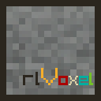
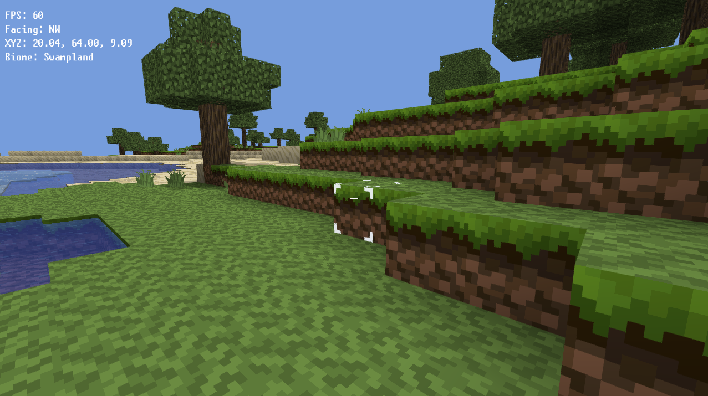

# rlVoxel


[](https://www.raylib.com/)

rlVoxel is a small voxel sandbox game written in C with raylib.
The project is also a learning-oriented codebase for anyone who want to understand voxel engine design (like i would be an expert or something).
Hopefully we can build some sort of "platform" that everyone can contribute and help others learn.

A little bit of background.

I've been a voxel game enjoyer for a long time, start as most likely everyone with Minecraft but playing every sort of voxel games. Luanti, Vintage Story, Teardown
Voxile, Alumeria, and so many others. For the past year or more i've been learning and enjoying graphics programming and make several (not public) implementations,
similar to this one in several languages and frameworks. I wanted to try and build something with the comunity and felt that doing it through RayLib could be cool.

So here's what may just become a nothing burger :D



## Build and Run

The following instructions were made to work mainly on Linux but should be "easily" adjusted to run on windows (SoonTM):

Quick path:

```bash
make fetch
make build
make run
```

Equivalent direct CMake flow:

```bash
cmake -S . -B build
cmake --build build -j
./build/rlVoxel
```

(May need adjustments to work on windows)

## CLI

```bash
./build/rlVoxel --seed <int64> --render-distance <chunks>
```

- `--seed <int64>`: deterministic world seed.
- `--render-distance <chunks>`: chunk radius around player.
- `--help` / `-h`: print usage.

## Controls

- `W A S D`: move
- `Space`: jump (hold repeats on landing)
- `Left Shift`: sprint
- Mouse: look around (when cursor locked)
- Left click: break block
- Right click: place block
- `Esc`: toggle cursor lock (closes debug menu first if open)
- Left click while unlocked: relock cursor (click is consumed)
- `F11`: toggle debug menu (profiler, frame graph, telemetry)

## Contributions

This project is open to contributions as it should. The main 'rules' are

- Be polite and respectful to everyone (this is not the Linux Kernel)
- Every contribution should be paired with detailed explaination of the concepts and documentation (i'll be adding a dedicated documentation soon)
- AI use is not to be hated but since the main goal is to learn, i would advise that less experienced contributors avoid using it, and the "pros"
  make the most effort to clean up after it and make it very understandable for newcomers to the field and programmers overall.
- When changing adding any image/texture ensure you ran it through and cleaner/optimizer like `optipng`.
- Project has already a `.clangd` and `.clang-format`so try to integrate these in your IDE / Editor of choice to keep the same
  formating accross the code.

## Architecture

I've tried to split this into a "Game" and a "Library".

- The library should contain the functionality to work with voxel. If you want to implement a specific technic try to provide an API through there
- The game is supposed to be able to show case tecniques with either compile flags or with in game toggles
  if at some point this becomes unsustainable we can simply split into several games/examples

The `src/` folder where the game lives, is also where world gen is located (this could be moved also into its own 'library').
This folder also contains physics implementation, some math that is used to attempt to mimic some of old school minecraft terrain (also up for change). `game` is where the main game logic lives (if we can already call it a game at this point).
The `gfx` folder tries to segregate away the rendering part so it's not all jumbled together. And `profiler/`
and `diagnostics` are dedicated to the _builtin_ ui and API for it.

### Design Choices

Project wise some design choices were made

- `cmake` as a build system -- not a personal favourite but a widespread and simple to integrate specially when using external libs
- Try as much to use external libs instead of reimplementing basic support functionallity (case in point, `AuburnFastNoiseLite`, `cimgui`, `stb`).
- `stb` is mainly used currently to simplify the work of contributors when it comes to having advanced data structures, thus
  reducing some overhead of doing a lot of reimplementation of manual memory management.
- `Make` instead of having a per OS script to simplify building i went with a makefile. I would be up to replace it with something
  better, like for instance `Just`.
- The project tries to be very self contained code wised and anything that's needed additional is tipically pulled in and built
  alongside. This is an attempt to reduce the need for contributors to have to install a bunch of dependencies and/or figure out
  where in the heck the dependency is in their package manager.
- `constants.h` works as a sort of global config file (I'll probabaly move this into a dedicated GameOptions object and read
  from a file at some point.)

## Game/Engine Features (some at least)

- Chunked world storage (`16 x 128 x 16` blocks per chunk)
- Procedural terrain and biome-driven surface features
- Queue-based skylight propagation
- Fixed 20 TPS simulation with render interpolation
- Multi-pass chunk rendering (solid, translucent, cutout)
- FastNoiseLite-backed world noise sampling (via `src/math/noise.c` wrapper API)
- Built-in frame profiler and telemetry UI
- Barebones Physics
- Block breaking and placing
- Block selection highlight

## Systems Technical Details

Check [docs/SYSTEMS.md](docs/SYSTEMS.md)

## TODO / Wishlist / Contribution Suggestions

Some features that i already have in mind were purposedly left out for the following reasons

- I want to make this available as soon as possible (not just a vague promisse)
- Developing those features publicly
- Hopefully bring some people that are actually good at this or want to learn and try to make them

That said here's a very very short list of missing features

- Clouds
- All UI
  - At least some ability to select a placeable block would be nice (the code already has structure in place)
- Block Resistance
- Multiplayer
- Multi-threaded processing (and overall performace)
- Water physics
- Day/Night Cycle
- What your heart desires (within reason)
- Visual and Audio -- Currently using some "open license" resources but if any artist wants to show case their
  work through this project by giving it it's own visual identity we'll definitly highlight that and give proper
  credit.

## Known Issues

- Leaves don't render when viewed below water
- Improper ice face handling (some inter ice block faces show in certain angles)

## Acknowledgements

- **raylib-cimgui**: integration inspired by [raylib-cimgui](https://github.com/alfredbaudisch/raylib-cimgui/) and [rlImGui](https://github.com/raylib-extras/rlImGui)
- **Textures**: BetaPixel by [DragonDePlatino](https://www.planetminecraft.com/texture-pack/betapixel/) (with custom changes)
- **Font**: [Unscii-16](http://viznut.fi/unscii/) and Font Awesome assets used by ImGui (see [license file](raylib-cimgui/extras/FontAwsome_LICENSE.txt))
- **BetaSharp Project**: For the ideias for the profiler strategy and display

If there is something that you feel is misrepresented please reach out.

## License

Project code is GPLv3 (see [LICENSE.txt](LICENSE.txt)).

## Notice

This project has no affiliation with Minecraft or Mojang AB.
It is an independent educational and hobby project.

Similarities are based on recreation using a [clean room](https://en.wikipedia.org/wiki/Clean-room_design) approach.
